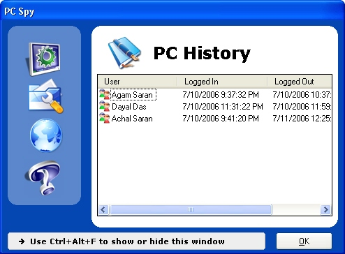



## PC Spy

### Description

There come many times when you want to know who has sat on your computer and when, so PC Spy is designed to perform such a task. PC Spy resides in your computer and monitors when which user has started the computer and when your computer has shut down. Quite handy when you want to know how much your computer has been used in your absence. Designed to simple and useful, it provides a easy-to-use and interactive user interferace to add to your experience.

Also has full documentation in .chm (HTML Help) format.
 
### More Info
 

             |
---                |---
**Submitted On**   |2006-07-11 07:54:16
**By**             |[Agam Saran](https://github.com/Planet-Source-Code/PSCIndex/blob/master/ByAuthor/agam-saran.md)
**Level**          |Intermediate
**User Rating**    |5.0 (10 globes from 2 users)
**Compatibility**  |VB 6\.0
**Category**       |[Complete Applications](https://github.com/Planet-Source-Code/PSCIndex/blob/master/ByCategory/complete-applications__1-27.md)
**World**          |[Visual Basic](https://github.com/Planet-Source-Code/PSCIndex/blob/master/ByWorld/visual-basic.md)
**Archive File**   |[PC\_Spy2007287172006\.zip](https://github.com/Planet-Source-Code/agam-saran-pc-spy__1-66001/archive/master.zip)

